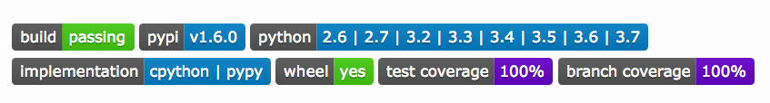

# Marie Kondo-ing Python Builds

For years I've written Python code that aggressively maintains compatibility
from Python 2.5 forward. I considered concurrently supporting Python 2 and 3 a
real accomplishment and source of pride.

In many cases I bridged a decade of
platform evolution almost seamlessly. But 2.x and 3.x make fundamentally
different assumptions. I face a growing list of unpalatable compromises in order
to continue supporting older legacy versions&mdash;not just 2.7, which is
rapidly approaching its [official 2020-01-01 end of
life](https://pythonclock.org/), but even anything prior to
3.6. Modern idioms like gradual typing and interpolating f-strings are right
out.

The Python 3 era began in earnest for me with 3.6. There were a lot of
nice-to-haves and good-for-yous in earlier 3.x, and I supported anyone who
wanted to use those. But I used 2.7 just as eagerly, and more often. If 2.x had
weaknesses, they were the devils I knew. But in late 2016 the advent of
f-strings and reliable dictionary ordering and the growing practicality of
gradual typing annotations made Python 3.6+ the place I wanted to live and work
full-time. Finally there was a Python 3 genuinely and notably more attractive to move
*to*.

I've continued to support back to 2.5 or 2.6 in some cases, and 2.7 forward
almost universally. But everything prior to 3.6 nows seems increasingly
primitive. I'd still keep supporting back versions if it were feasible, but I
haven't found a satisfying way of doing so.

Python sadly lacks the aggressive time-hopping JavaScript enjoys with
[Babel](https://babeljs.io/) and similar transpilers. In JS, developers can use
the latest idioms then on-the-fly convert code to whatever implementation is
needed for deployment. This let me use ES2015 2 years before I otherwise could
have, and even after ES2015 became well-supported, not care if this or that
deployment wasn't so up to date. By giving early access to new features to those
who want them without requiring the whole community be ready to make the same
switch, it decouples development investments from the mechanics of platform
evolution. The extended tool chain's a bit messy to set up, but once in place,
it works brilliantly.

Python's community isn't nearly so transpiler-savvy. The compatibility it invested
in was typically forward-looking, from 2 to 3. The 2to3 tool and related
libraries like [six](https://pypi.org/project/six/) are well-done and
well-integrated into the tool chain, but they support living in Python 2 and
cross-supporting Python 3 much better than they support living in the latest
Python 3 and cross-supporting earlier versions as a legacy. The 3-to-2 direction--which
critically includes 3.x to prior versions of 3--never got the same degree of love and support.

It's been over 2 years, for example, since f-strings entered the Python
mainstream. Yet there's apparently still no good way to backport them. Whether
you're on 2.7 or 3.5, you're equally out of luck. That means you can't even use
them with the accelerated [PyPy](https://pypy.org/) compiler, which as of and
for many quarters prior to this writing has 3.5 as its latest production-ready
release. They're also not available for embedded versions like
[MicroPython](http://micropython.org/) seeking to extend Python's reach.
[future-fstrings](https://github.com/asottile/future-fstrings) does implement
for some legacy platforms via a file-preprocessing trick, but by now f-string
support should be built-in and not require fraught runtime tricks. So while
tools like [python-future](https://python-future.org/) and
[3to2](https://pypi.org/project/3to2/) might've helped keep older versions still
useful and new idioms more quickly gain acceptance and common usage, they're not
improved at a sufficient pace than I can depend on them.

<!-- source: https://openclipart.org/detail/284228/woman-vacuuming -->
In 2016 or 2018, colleagues and clients used and needed Python 2 so frequently
that cross-supporting it was a strict requirement. If I couldn't use a new
feature because of that, well, that's life. But time marches on. In 2019 I see
Python 3.6 and 3.7 eagerly used, and not much call for 2.x. Developers,
students, and platform providers all seem to have finally gotten to Python
3&mdash;and the freshest versions at that. So I too will let go of the Old World
and fully embrace the New.

In the spirit of Marie Kondo, I've decided to tidy up that which no longer
sparks joy. But first, let me honor the soon-departed: "Python 2, thank you for
your long, faithful, and *extremely* valuable service! You too, Python 3.0-3.5.
You were...um...important transitional vehicles." And now, let the decluttering
begin...

I'll publish terminus versions of my packages for `sys.version_info[:2] < (3,
6)`. Their dependencies will be frozen and I'm prepared to make critical fixes
when requested. I'd still help clients tied to older versions, of course,
especially if they want help modernizing and refactoring. But for myself, new
work moves to Python 3.6+ with no looking back. The shims and polyfills come
out! Type annotations go in! Everything on a modern foundation!
